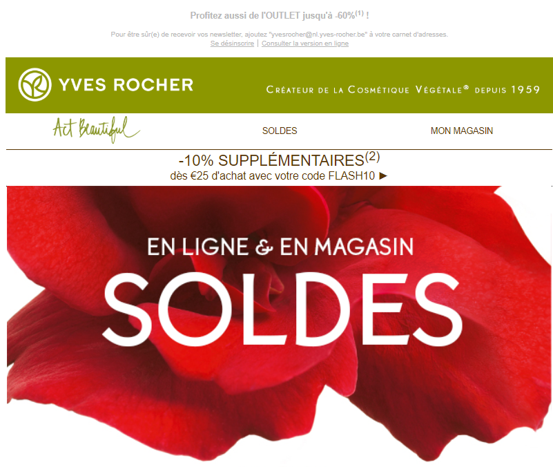
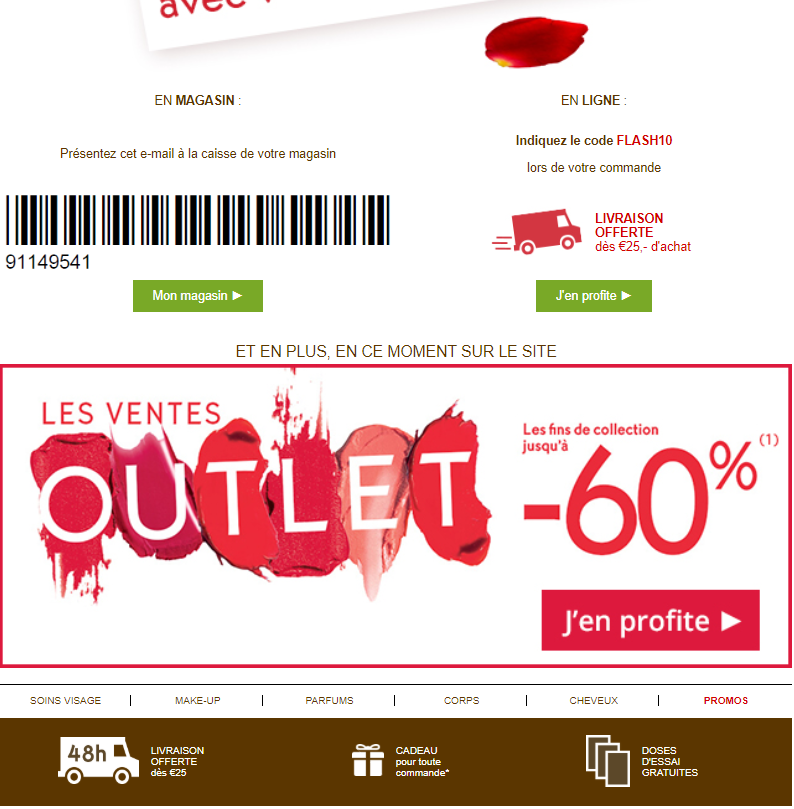
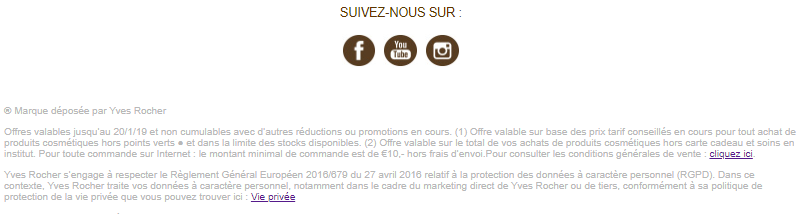

Newsletter Yves Rocher
=================================

Project of [Ismail Joseph](https://github.com/Fesouille).
----------------------------------

*Small exercise to practise the basics of editing a Newsletter*

* Project:
For this project, I have to make a newsletter based on a maquette provided by my coachs. The challenge is to only use HTML and properties specifics to newsletters (HTML inline style, no margins, no divs (only tables)...).

* Content:
	* HTML file: contains the full newletter i.e. the content and the style

* Check it out! :
	* [My first Newsletter](https://fesouille.github.io/Newsletter-Yves-Rocher/)

* A few illustrating pictures:

